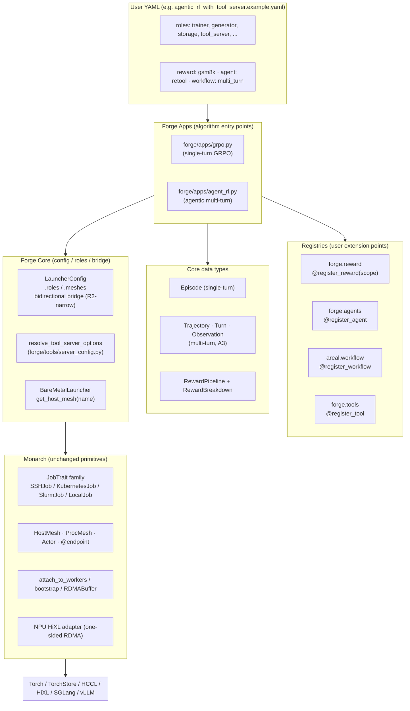
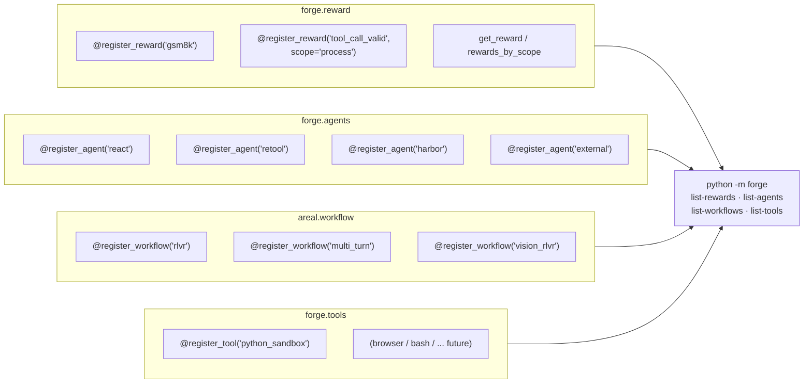
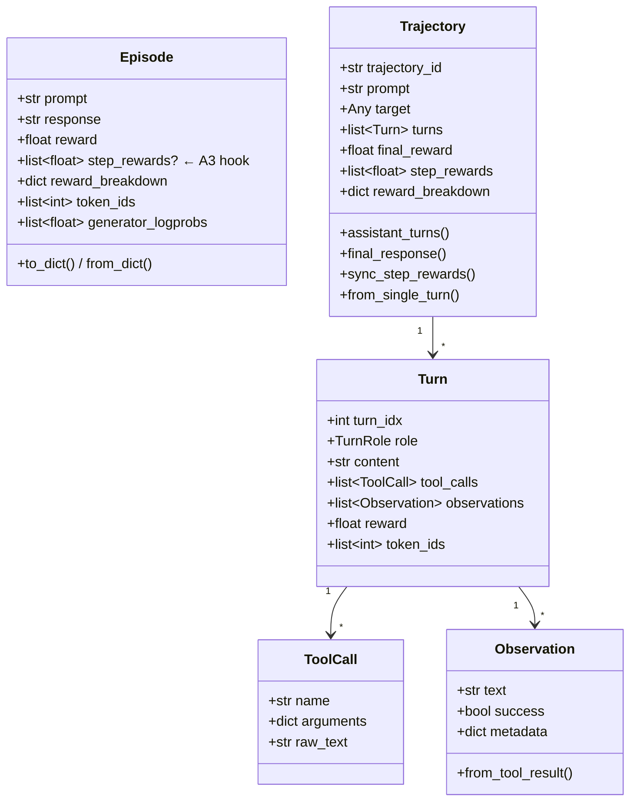
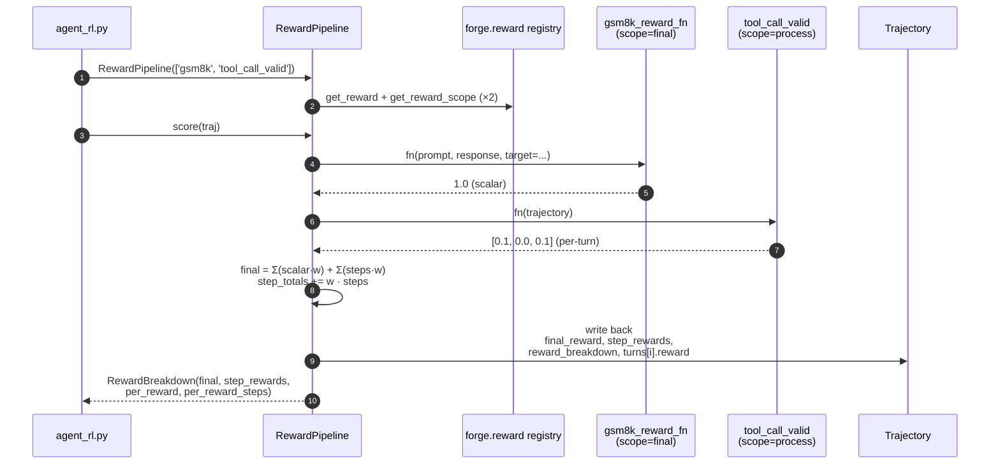
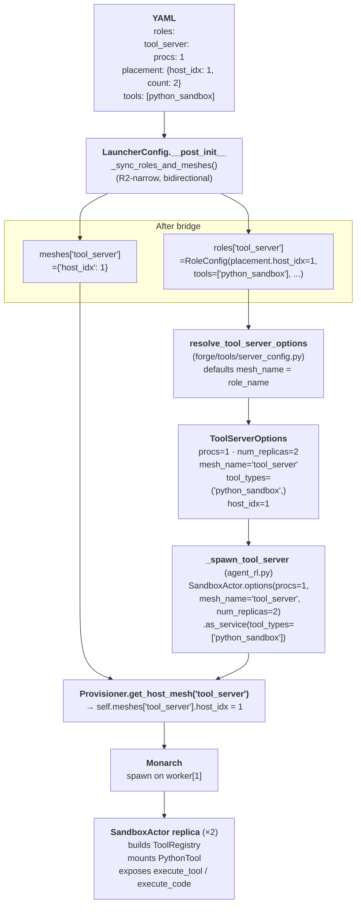
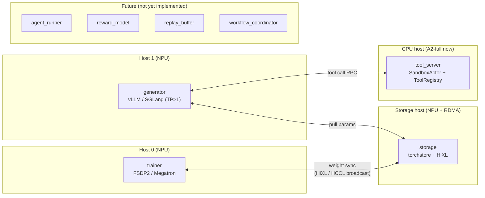
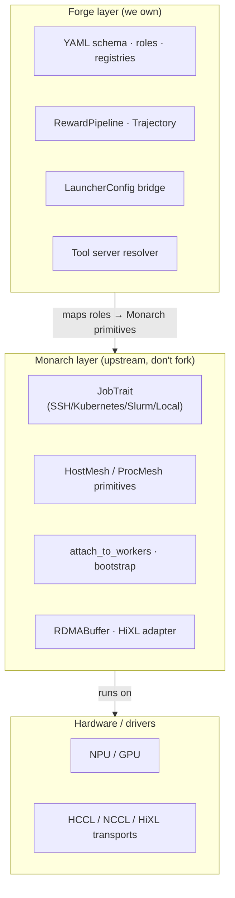
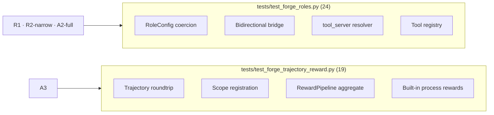

# Forge Architecture — Current State

> Snapshot as of Phase A1 + R1 + A2-full + R2-narrow + A3-MVP landed.
>
> Source of truth for "what's actually wired up today" — as opposed to
> [`agentic_rl_architecture.md`](agentic_rl_architecture.md) which carries the
> longer-term vision + phase plan.

The diagrams in this file use [Mermaid](https://mermaid.js.org/); GitHub / VS Code /
Cursor render them inline.

## 1. Layer stack



## 2. Registries at a glance



## 3. Data types — Episode vs. Trajectory



## 4. Reward pipeline (final + process scopes)



## 5. Placement chain — tool_server on a dedicated host



## 6. Role catalog — which role is where



## 7. End-to-end request flow (agentic GRPO)

```mermaid
sequenceDiagram
    autonumber
    participant User as User (YAML)
    participant Launch as forge launch CLI
    participant App as agent_rl.py
    participant Prov as Provisioner<br/>(BareMetalLauncher)
    participant Gen as Generator<br/>(vLLM replica)
    participant Agent as AgentActor<br/>(ReTool)
    participant Tool as SandboxActor<br/>(tool_server)
    participant Store as torchstore
    participant Tr as Trainer (FSDP2)

    User->>Launch: forge launch cfg.yaml
    Launch->>App: hydrate LauncherConfig
    App->>Prov: spawn meshes per roles
    par parallel spawn
        Prov->>Gen: spawn on host=generator.host_idx
    and
        Prov->>Tool: spawn on host=tool_server.host_idx<br/>(ToolRegistry mounts python_sandbox)
    and
        Prov->>Store: spawn on storage host
    and
        Prov->>Tr: spawn trainer procs
    end

    loop rollout
        Agent->>Gen: agenerate(prompt)
        Gen-->>Agent: assistant text + tool_call
        Agent->>Tool: execute_tool('python_sandbox', {code})
        Tool-->>Agent: ToolResult(success, output)
        Agent->>Agent: append Turn to Trajectory
    end

    Agent->>App: trajectory complete
    App->>App: RewardPipeline.score(traj)<br/>→ final_reward + step_rewards
    App->>Tr: enqueue Episode (carries step_rewards)
    Tr->>Tr: PPO / GRPO update<br/>(scalar loss today;<br/>per-step loss = A3 follow-up)
    Tr->>Store: push new weights
    Gen->>Store: pull new weights<br/>(collective broadcast)
```

## 8. Boundary rules (what lives where)



**Rules of thumb:**

- Anything YAML-visible or algorithm-visible lives in Forge.
- Anything that describes *how to spawn workers on some cluster* lives in Monarch's
  `JobTrait`; Forge's `BareMetalLauncher` is a thin adapter for pre-provisioned SSH
  workers.
- Anything hardware-specific (HiXL / HCCL / NPU quirks) lives behind Monarch's transport
  layer; Forge never imports `torch_npu` directly.

## 9. What's intentionally *not* yet in the diagram

Tracked in [`agentic_rl_architecture.md`](agentic_rl_architecture.md)'s phase plan;
listed here so readers don't mistake the omission for a gap in understanding.

| Piece                                    | Why deferred                                                                |
| ---------------------------------------- | --------------------------------------------------------------------------- |
| General-purpose placement scheduler      | No concrete heterogeneous cluster driving it yet.                           |
| Transport abstraction (R3)               | Monarch RPC + HiXL cover every wire we use today.                           |
| `agent_runner` as independent role       | Currently rides on `generator`; separation needs A2-follow.                 |
| PPO/GRPO consuming `step_rewards`        | Data carrier ready (`Episode.step_rewards`); loss change is algorithm-side. |
| Workflows emitting `Trajectory` natively | `Trajectory.from_single_turn` bridge is good enough until needed.           |

## 10. Test coverage map



Total: **43 passed, 0 lint errors.**
